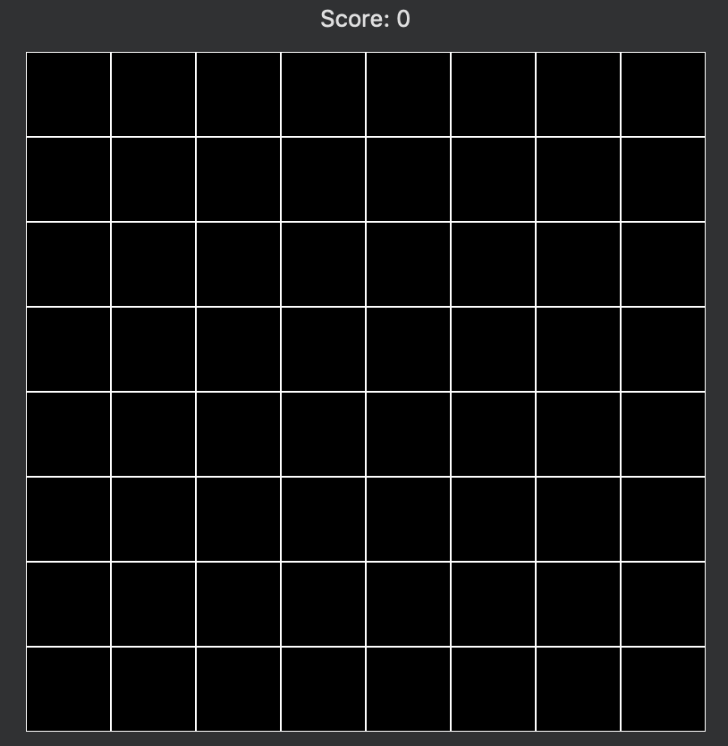
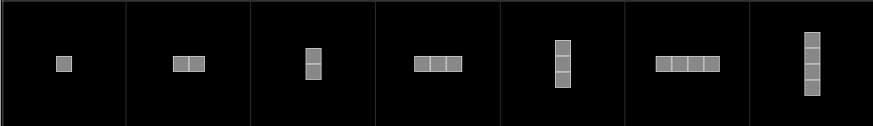
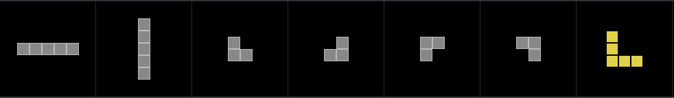
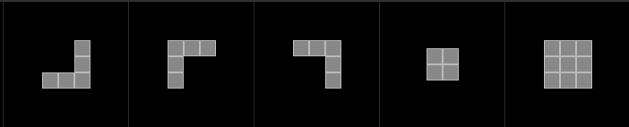
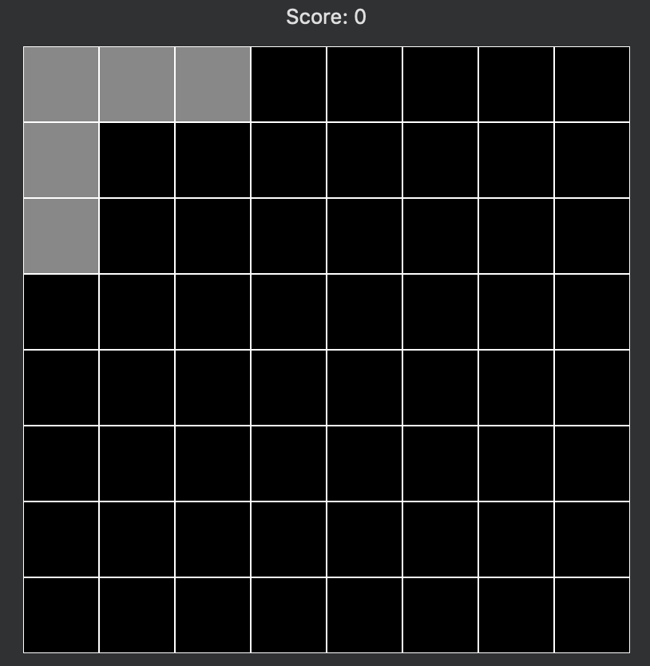

# blocksAI
An attempt at using Deep Q Reinforcement Learning to teach an ai a blocks game.
###Description of the Game
"Blocks" is a simple game in which you place pieces on a board until you aren't able to fit pieces 
on the board anymore. The goal is to reach the highest score you can. You score points by placing
pieces and clearing lines (more on that below).

The board is an 8x8 square as shown below:

There are 19 different pieces that are chosen at random, three at a time. You place one piece on the
board, leaving you two pieces that must be placed, then one piece that must be placed. 
When all three pieces are placed, the game randomly chooses 3 new pieces.

Pieces can not be rotated but can be placed freely anywhere on the board where it will fit.

All 19 pieces:

Example of a board with one piece placed:

When you are unable to place a piece due to it not having anywhere that it will fit on the board, 
the game is over.

### Libraries used
- Keras
- Keras-RL
- Tensorflow
- Tensorboard (although I couldn't get it to actually show anything useful)
- Numpy
- OpenAI Gym

### A brief overview of the code
Functionality dealing with pieces, is in the ai/Pieces.py module.

Functionality dealing with the board, including applying a new piece to an existing board is in
ai/Board.py

The ai/BlocksEnv.py module is the environment which handles applying chosen pieces to the board, 
calculating and returning rewards, etc.

The ai/BlocksProcessor.py doesn't actually do anything. At one point I had functionality in there
to parse actions into workable data structures when I realized what it was doing was simple enough
to just put right in the environment's step() function

### Assumptions I've made and how the network is set up
 I suppose the big assumption I've made, first and foremost, is that deep Q learning is the right 
 approach to this problem. I mean, if it can learn tic-tac-toe, isn't this just a more complicated
 version of that?
 
 I've read books on ML and Deep Q Learning, I think I have the gist, but there's still plenty that
 I'm sort of lost on. For example, I'm kind of guessing at what I should be using for the NN and
 what the inputs and outputs should be. So, let's dive in to that.
 
 I've tried several different setups for the NN. The overall idea I've been running with is a
 flatten() layer (due to how the batches run in RL), several dense layers (I've tried various outputs
 ranging from 750 to 10000 tensors) with 'relu' activations in between, and on the final layer,
 a dense layer (which I've tried both linear and sigmoid activation) and a dim output of 1 tensor
 per possible action.
 
 Talking about inputs and outputs for a second, the input I'm giving the NN is the 8x8 board, where a
 1 means "there is a part of a piece here" and a 0 meaning an empty space. The board is flattened
 into a 1d array. Then I take the one-hot encoded pieces in order of piece1, piece2, piece3, and 
 append then to the end of the board. That's the input. Basically "here's the board and available 
 pieces". If a piece is already played, it's a 19-element, 1d array of all zeros. This gives you a 
 121-element, 1d array which represents the state of the board and what pieces are available to play.
 
 The output (which python yells at me about if it's anything other than 192 for some reason) is a 
 192 output_dimension, which is one dimension for each piece in every position of the board, including
 positions on the board where some pieces don't actually fit (like on the edges) and including pieces
 that are already played.
 
 I guess my first question would be... is that correct? Or am I way off base here? (More questions 
 below)
 
 The policy is an eps_greedy policy that linearly reduces from performing random moves 100% of the time
 to around 1% of the time over the course of about 80% of the total training steps.
 
 I've tried several variations of length of training, from 1 million steps to 10 million steps.
 
 ###Scoring and Rewards
 The game is scored where you get 1 point per "size of the piece placed", plus incrementally increasing
 rewards for lines cleared. For example, if you place a piece that has 3 blocks, you get 3 points. If
 you clear one line, that's 8 blocks cleared and thus 8 points (in addition to the points from 
 the piece being placed). If you clear multiple lines at the same time you get 1.5x bonus for 2 lines simultaneously 
 cleared, 3x for 3 lines, etc.
 
 I initially tried a rewards mechanism where placing a piece where it couldn't fit (either because the
 board was full in that spot or because the piece went off the board) or was already played (an 
 'empty' piece) as zero (no negative impact), reward was the actual game score of that move, 
 and "game over" resulted in a negative score.
 
 Other variations I've tried have included minor and major negative scores for playing empty pieces and
 placing pieces where they couldn't fit, and hard-coded values for placed pieces and line clearing.
 
 ###Results
 Well, I guess it's no surprise that it's not working, else why would I be begging you for your help? ;)
 
 The bottom line is that this is my first attempt at anything ML related, and I'm really just shooting
 in the dark here, trying to figure things out.
 
 The actual results, on every variation of all the different aspects of this setup have resulted in 
 essentially the same thing: It runs in "explore" mode for a pretty long time, eventually heads over
 to non-explore mode, and utterly fails. It generally scores spectacularly worse in game score and 
 reward than if it were just choosing actions at random.
 
 ###Questions I have
 - What am I doing wrong? Lol, ok that's a little vague
 - Am I feeding the correct data into the NN?
 - Should I be getting a 192 random int output as an action?
 - Should I be negatively scoring "actions" that involve pieces going off the board or playing pieces
 that have already been played?
 - Is my network setup wildly off-base or does it just need some tweaking/experimentation?
 - What metrics should I be asking tensorboard for? It doesn't show me anything except for reward
 and episode_steps.
 
 ### Many Thanks
 If you're reading this, and you didn't somehow randomly find this on Google, then that means you 
 probably came with the intention of helping, in which case, I'm very grateful. Thank you!  
 
 